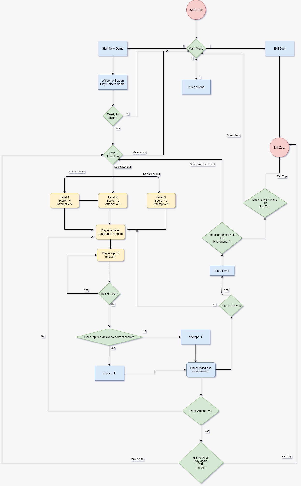

# **NathanBlaga_T1A3 - T1A3 - Terminal Application**

## **Quiz Game - Zop**

### **Nathan Blaga GitHub Repo:** [https://github.com/NJBLAGA/NathanBlaga_T1A3](https://github.com/NJBLAGA/NathanBlaga_T1A3)

### **Trello Board - BLAGA - Portfolio:** [https://trello.com/b/3egElIWF](https://trello.com/b/3egElIWF)

## **Software Development Plan:**

### **Describe at a high level what the application will do:**

Zop’s main function is to provide the player with a fun new take on quiz games. It delivers to the player a fresh, stylish and unique experience. The game provides the player with a source of knowledge and offers the possibility to learn new information. Zop will ask the player a serious of questions, ranging in diffucilty depending on the level being played on. Once the player has inputed their choosen answer, Zop will formulate if the players answer is indeed the correct or incorrect answer. A scoring system in conjunction with limited attempts per level provides the player with a exciting drive to answer correctly and test their knowledge.

### **Identify the problem it will solve and explain why you are developing it:**

The two main problems Zop aims to solve is that of entainment and testing ones knowledge.
Zop was created and is being devloped as a terminal game. Its main function is to bring fun and enjoyment to the player. Whether it is inbetween classes, lunch breaks at work, or stuck at home on a rainy day faced by bordem. Zop is being developed to provide fun to the player in a simple and lightweight package. Its secondary function aims to test the player’s knowledge and envoke their comeptitive side. Zop is being devloped to not only push player's knowledge base in a challenging and interesting approach but in stylish and appealing way.

### **Identify the target audience:**

Zop's target audience is not defined by an age group or demograhpy. The game is desgined and is intented for players of all ages and backgrounds. For new players who are acustoomed to quiz games, Zop provides a easy and user-friendly experience that helps any new player test their knowledge. While for more seasoned vertians, Zop aims to provide a more challeneging and robust experience.

### **Explain how a member of the target audience will use it:**

Any user who plays Zop will find themseleves in side one of its challeneing levels in mintues without any hassle or diffucilty. Below in the instructions section, players can follow the very simple and user friendly step by step guide to not only install but play Zop. Moreover once the game is running, the game guides the player in various ways and even provides command lines and a main menu page for the games rules and instructions.

## **Features of Zop:**

Zop isnt your average quiz game, it provides the player with a fun and entertaing experience. This is due to its interesting and diverse features. Below are Zop's listed features, describing how each feature works and their intended functions.

**Main Menu Sytem:** The entire game of zop is interconnected thorugh a menu system. This system allows the user to navigate inbetween menus all the way from the title page to any of the 3 levels provided, to an indepth rules and isntructions page. The menu system was devleoped with a test driven development approach. All functions and pathways provided by the system have been tested and constructed to ensure no errors can occur.

**End of question panel:** The game Zop consists of 3 different levels all with 30 unquie questions with increasing diffucilties. The player is asked at random one of the 30 questions for that level. The player is then prompted to answer either a,b,c or d. Zop will then display an end of question panel in which several key stats are provided. The user will be shown if the inputed the correct answer. If the inputed answer was correct, Zop will then display their current score and attempts remaining. If the inputed answer was incorrect, Zop will inform the player that, the inputed answer was incorrect, provide the correct answer, display the players current score and attempts remaining. This feature allows the player to have a play by play view on how the game is progressing after each question.

**Question difficulty:** Zop displays the diffcuilty of each question as it is presented to the player. This will aid in illstrating to the player the level of diffuculty pool the question derives from.

**Invalid inputed answer:**Another interesting feature is that of invalid input prompts.
If the user inputs an answer that is not a,b,c or d, then they are promoted to try agian till the input one of the 4 correct inputs. The user will not lose any attempts for an invalid inputed answer.

**Rules/Instruction Menu:** Another interesting feature of Zop is that of its rules and instructions menu. This menu can be accessed through the main menu or by command line arguments . These command lines arguments can be found below in the zop-helper section. The rules and intrustions menu aid the player in explaining how the game is run and played. It also instructs the player on the requirements of completing any given level and the attempts remaining system.

## **User Interaction and experience:**

Zop is being developed with the intention of providing the user with a fun and error free experience. Zop's desgin and menu system aids in navigating the player through the games variours menus without any hassle or stress. Built for seasoned experts or new users, Zop aims to guide the player from starting Zop up, to entering their name, to spending hours trying to get a perfect run on all levels. None of Zop features are hidden or need a considerable effort by the player to utilise them. Instead the features are provided and displayed to the player from the very onset of Zop asking them their first question. The features of Zop were built with the intention to aid the player's experience and so it was vital to instruct the player through the rules and instruction menu on said features and game mechanics.

The end of question panel feature provided by Zop to the player help to enhance their in game experience. By providing a constant feed of infomation inbetween questions, the player is able to see if they are one question away from completing the level or failing it. Another feature of Zop that excels at enhancing the players experience is that of Zop prompting the playing they have entered a invalid answer. This allows the player to continue to progress through the level without the Zop awarding them a correct or incorrect answer based on the player mistyping their answer or not understanding what they are supposed to enter in the first place. While these variours features help with the in game experience, the menu system enhances the players out of game experience with easy navigation and interaction inbetween menus.

## **Control Flow of Zop:**

Below Zop intial control flow and desgin is shown. The desgin was kept intact from then inital desgin to the current version of the game.

## **Implementation Plan:**

## **Testing:**

## **Instructions:**

### **Installation:**

### **Dependencies:**

### **System requirements:**

## **Zop_Helper:**

## **Screenshots:**
