# **NathanBlaga_T1A3 - T1A3 - Terminal Application**

## **Quiz Game - Zop**

### **Nathan Blaga GitHub Repo:** [https://github.com/NJBLAGA/NathanBlaga_T1A3](https://github.com/NJBLAGA/NathanBlaga_T1A3)

### **Trello Board - BLAGA - Terminal App:** [https://trello.com/b/3egElIWF](https://trello.com/b/3egElIWF)

## **Software Development Plan:**

### **Describe at a high level what the application will do:**

Zop’s main function is to provide the player with a fun new take on quiz games. It delivers a fresh, stylish and unique experience, provides the player with a source of knowledge, and offers the possibility to learn new information. Zop will ask the player a serious of questions ranging in difficulty. Once the player has selected their answer, Zop will formulate whether it is correct or incorrect. A scoring system in conjunction with limited attempts per level provides the player with an exciting drive to answer correctly and test their knowledge.

### **Identify the problem it will solve and explain why you are developing it:**

Zop aims to solve two main issues: entertainment and testing one's knowledge. Zop was created and is being developed as a terminal game. Its main function is to bring fun and enjoyment to the player. Whether it is in-between classes, lunch breaks at work, or stuck at home on a rainy day faced by boredom. Zop is being developed to provide fun to the player in a simple and lightweight package. Its secondary function aims to test the player’s knowledge and invoke their competitive side. It not only pushes the player's knowledge base in a challenging and interesting approach, but also in a stylish and appealing manner.

### **Identify the target audience:**

Zop's target audience is not defined by any age group or demographic. The game is designed and is intended for players of all ages and backgrounds. For new players who are not accustomed to quiz games, Zop provides an easy and user-friendly experience that helps them test their knowledge. For seasoned veterans, Zop aims to provide a more challenging and robust experience.

### **Explain how a member of the target audience will use it:**

Any user who plays Zop will quickly realise there are no hassles or difficulties. Thoughout the instructions section, players can follow the very simple guide to not only install but play Zop. Moreover, once the game is running, it guides the player in various ways and provides command lines in conjunction with an in-game menu for the games rules and instructions.

## **Features of Zop:**

Zop isn’t your average quiz game. It provides the player with a fun and entertaining experience. This is due to its interesting and diverse features. Below are Zop's listed features, describing how each feature works and their intended functions.

**Main Menu System:**

The entire game of Zop is interconnected through a menu system. This system allows the user to navigate in between menus all the way from the title page to any of the 3 levels provided. The menu system was developed with a test driven development approach. All functions and pathways provided have been tested and constructed to ensure no errors can occur.


**Player Progression Display:**

The game Zop consists of 3 different levels, all with 30 unique questions with increasing difficulties. The player is asked a question at random and is then prompted to answer either a, b, c or d. Zop will then display an end of question panel in which several key stats are provided. The user will be shown if they selected the correct answer. If the inputted answer was correct, Zop will then display the player's current score and attempts remaining.


If the selected answer does not match the array's answer, Zop will inform the player that it is incorrect. It also provides the correct answer, displays the player’s current score and attempts remaining for that level. These features allow the player to have a play by play view on how the game is progressing after each question.


**Question difficulty:**

Zop displays the difficulty of each question as it is presented to the player. This will aid in illustrating the level of difficulty pool the question stems from.

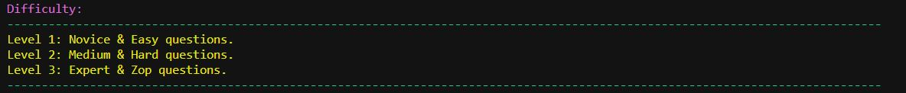

**Invalid inputted answer:**

Another interesting feature is that of invalid input prompts. If the user inputs an answer that is not a, b, c or d, they are then prompted to try again until they have entered one of the 4 correct inputs. The user will not lose any attempts for an invalid inputted answer.

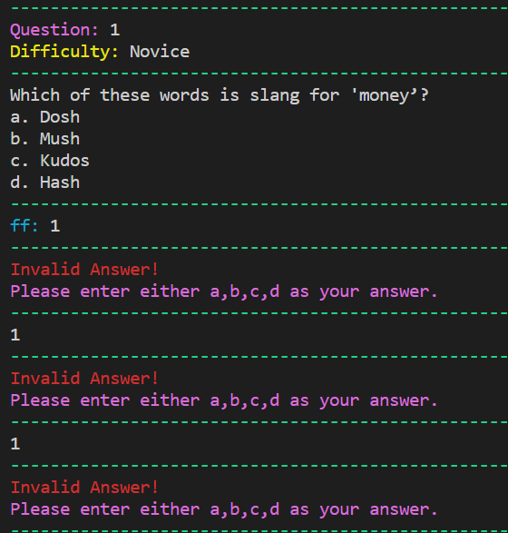

**Rules/Instruction Menu:**

The rules and instructions menu can be accessed through the main menu or by command line arguments. These command lines arguments can be found in the Zop-helper section. These functions aid the player in explaining how the game is run and played. It also instructs the player on the requirements of completing any given level and the attempts remaining.

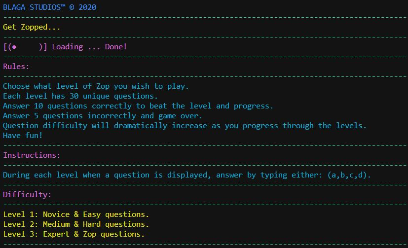

## **User Interaction and Experience:**

Zop is being developed with the intention of providing the user with a fun and error free experience. Zop's design and menu system aids in navigating the player through the game's various menus without any hassle or stress. Built for seasoned experts or new users alike, Zop aims to guide the player from beginning a new game, entering their name, to spending hours trying to get a perfect run on all levels. None of Zop's features are hidden or need a considerable effort by the player to utilise them. Instead, the features are provided and displayed to the player from the very onset of Zop.

The player progression feature helps to enhance the in-game experience. By providing a constant feed of information in between questions, the player is able to see if they are one question away from completing the level or failing it. Zop also prompts the player if they have entered an invalid answer. While these various features help with the in-game experience, the menu system enhances the players out of game experience with easy navigation and interaction in between menus.

## **Control Flow of Zop:**

The latest design of Zop follows the initial design and control flow developed at the start of the project.

**This can be seen below:**


## **Implementation Plan:**

An implementation plan was created to set out how each feature of Zop would be developed and integrated over a set amount of time. Each feature included a checklist containing vital components and tasks which were assigned a timeframe based on priority. Screenshots below depict the final state of the implementation plan. All features and checklist items were completed within time frames and all bugs and errors were resolved.


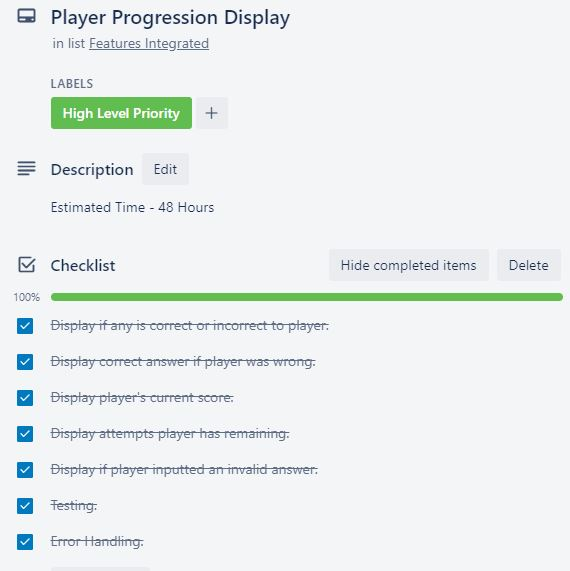
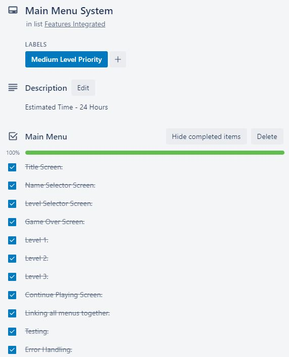
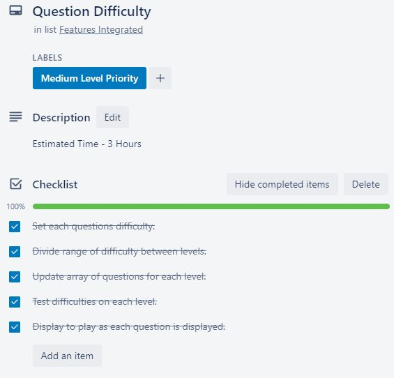
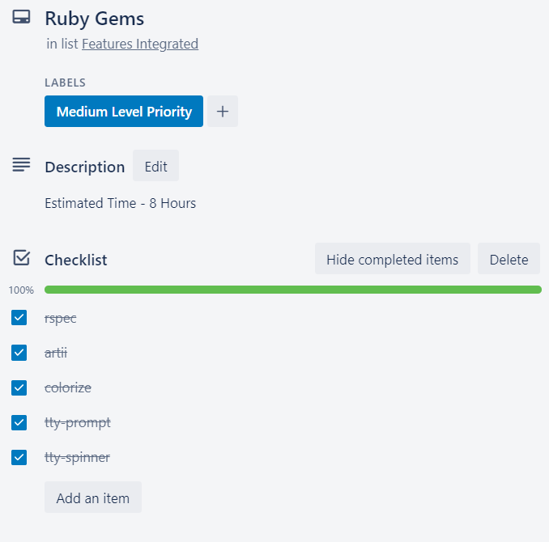
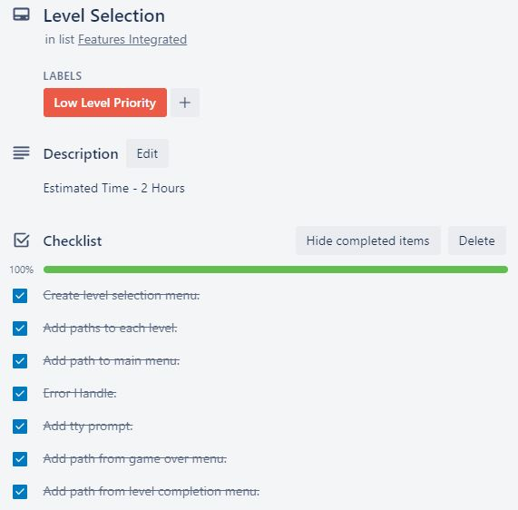
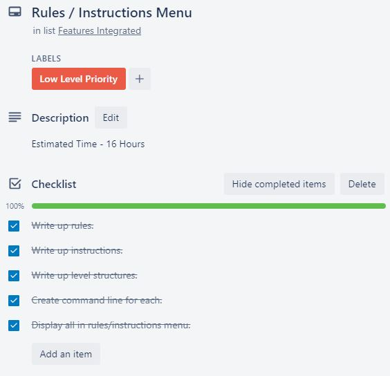

## **Testing:**

During the development of Zop, two main tests were manually conducted to ensure the game was running as expected. These tests aided in error handling and refining the game's code.

**The two tests were named:**

- correct_answer_testing.rb
- score_attempts_testing.rb

### **Test results and data:**

#### **Google Docs - Testing - Terminal App:** [https://docs.google.com/spreadsheets/d/1HHdA5gUlRbrPnrXBQfdPw3rGonBHYkLfq_sWUu_jHIM/edit?usp=sharing](https://docs.google.com/spreadsheets/d/1HHdA5gUlRbrPnrXBQfdPw3rGonBHYkLfq_sWUu_jHIM/edit?usp=sharing)

### **correct_answer_testing.rb**

The correct_answer test was created and run to check if the game was receiving an inputted answer from the player. Once received, the test checks if the code is cross referencing that answer with the correct answer located within the questions array. The test then returns whether the two answers are a match or not. It also contains the same for loop and if statement found in the actual code. However instead of returning information to the player, it was assigned a simple match, no match parameter. After running the test on several questions, the results earning a matched response were crossed referenced by hand with the bank of answers for all questions. This acted as a second layer of testing to ensure any information displayed to the player is correct and accurate.

```ruby
# Testing questions array with 5 unique Questions.
# Each Question in the array has an assigned variable from the question bank alongside correct answer and corresponding difficulty. 
# Using the above array, level 1 returns the exe_game(questions) method and runs the quiz using the above questions.

for question in questions
# Run a for loop and iterate through all 5 Question elements in the questions array.
    puts question.content
    # Prompt user with a question.
    answer = gets.chomp()
    # Gets is used to to obtain inputed answer.
    if answer == question.answer
    # If statement is used to check inputed answer == question.answer stored in the array .
        puts "------------------------------------------"
        puts "match"
        # If true and answer == question.answer display match.
        puts "------------------------------------------"
        else 
        puts "------------------------------------------"
        puts "no match"
        # If false and answer does not == question.answer display no match.
        puts "------------------------------------------"
        puts question.answer
        # If false and answer does not == question.answer display correct answer to the question.
    end
end
```


Several test cases were run in order to get a more in-depth spread of possible inputs.

The first test case was run using inputs of "a", "b", "c" and "d".

**Results below:**

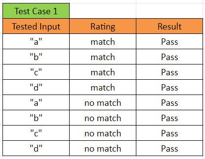

A second test case was run in which empty inputs were entered such as " ".

**Results below:**

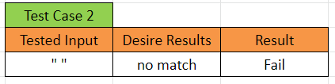

The third test case was run using inputs of "1", "2", "3" and "4".

**Results below:**


### **score_attempts_testing.rb**

The score_attempts test was designed and run to check if the code was assigning the right action to score and attempts remaining. If the player entered a correct answer, their score would increase by 1. If the player entered an incorrect answer, their attempts would decrease by 1. Similar to thecorrect_answer test, it takes the inputted answer by the player and cross-references it against the stored answer in the question array. However it adds 1 to the score if correct and subtracts 1 from the attempt if incorrect.

```ruby
# Testing questions array with 5 unique Questions.
# Each Question in the array has an assigned variable from the question bank alongside correct answer and corresponding difficulty. 
# Using the above array, level 1 returns the exe_game(questions) method and runs the quiz using the above questions.
# -----------------------------------------------------------------------------------------
# Variables for testing: score and attempts.
score = 0
attempts = 5
# -----------------------------------------------------------------------------------------
for question in questions
# Run a for loop and iterate through all 5 Question elements in the questions array.
    puts question.content
    # Prompt user with a question.
    answer = gets.chomp()
    # Gets is used to to obtain inputed answer.
    if answer == question.answer
    # If statement is used to check inputed answer == question.answer stored in the array .
        puts "------------------------------------------"
        puts "match"
        # If true and answer == question.answer display match.
        score += 1
        # If true and answer == question.answer add 1 to score variable.
        puts "------------------------------------------"
        puts "Score: " + score.to_s
        # Display current score.
        puts "Attempts left: " + attempts.to_s
        # Display current attempts remaining.
        puts "------------------------------------------"
    else 
        puts "------------------------------------------"
        puts "no match"
        # If false and answer does not == question.answer display no match.
        attempts -= 1
        # If false and answer does not == question.answer subtract 1 from attempt variable.
        puts "------------------------------------------"
        puts "Score: " + score.to_s
        # Display current score.
        puts "Attempts left: " + attempts.to_s
        # Display current attempts remaining.
        puts "------------------------------------------"
        puts question.answer
        # If false and answer does not == question.answer display correct answer to the question.
    end
end

```


Several test cases were run in order to get a more in-depth spread of possible inputs and their impact on score and attempts.

The first test case was run using inputs of "a", "b", "c" and "d".

**Results below:**

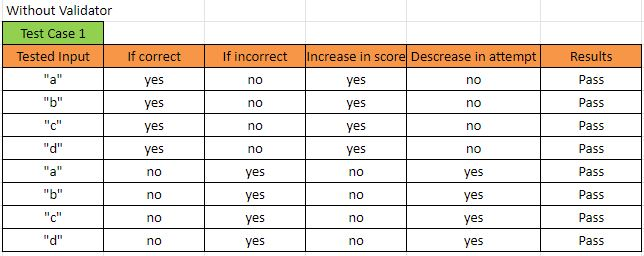

A second test case was run in which empty inputs were entered such as " ".

**Results below:**


The third test case was run using inputs of "1", "2", "3" and "4".

**Results below:**

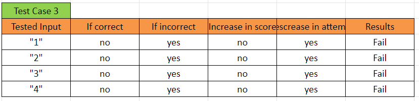

Running test cases of "a", "b", "c" and "d" resulted in the code and test performing as intended. However, any input other than "a", "b", "c" and "d" would not only result in an incorrect answer, but also subtracted 1 from the attempts remaining variable.

This was an issue as the game could not distinguish between an incorrect answer and a mistype. To resolve this issue, a validation module was implemented. Its function was to make sure that only answers of "a" "b" "c" and "d" would be accepted. Integrating this into the code meant that an error in the player’s inputted answer was not considered valid.

Running this module through a loop allowed the game to prompt the user multiple times for a correct input until a valid answer was entered. This module solved the main issue with invalid player inputs and added value to the overall performance of the game.

The same test cases above were run with the new validation module in order to get a more in-depth spread of possible inputs and their impact on the player's score and attempts remaining.

The first test case was run using inputs of "a", "b", "c" and "d".

**Results below:**

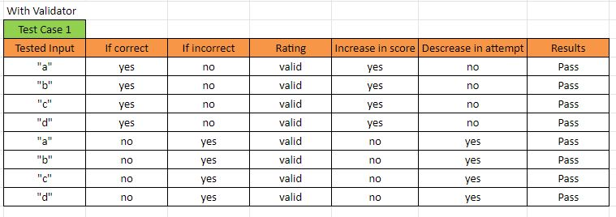

A second test case was run in which empty inputs were entered such as " ".

**Results below:**

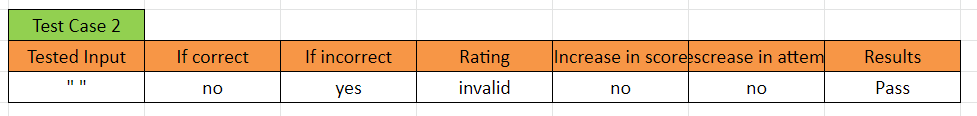

The third test case was run using inputs of "1", "2", "3" and "4".

**Results below:**

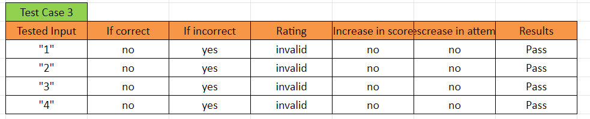

## **Instructions:**

### **System requirements:**

- Win32/Console/ANSI (for Windows)

### **Dependencies:**

- gem "artii", "~> 2.1"

- gem "colorize", "~> 0.8.1"

- gem "tty-prompt", "~> 0.22.0"

- gem "tty-spinner", "~> 0.9.3"

### **Installation:**

```ruby
./install_zop.sh
```

### **Run:**

```ruby
./run_zop.sh
```

### **Zop_Helper:**

```ruby
ruby zop_helper.rb -r
```

- Run to display zop_helper rules.

```ruby
ruby zop_helper.rb -i
```

- Run to display zop_helper instructions.

```ruby
ruby zop_helper.rb -d
```

- Run to display zop_helper difficulties.

## **Reference List:**

*Who Wants to be a Millionaire: The Quiz Book 2000,* Pan Macmillan Australia, Sydney, Australia.
